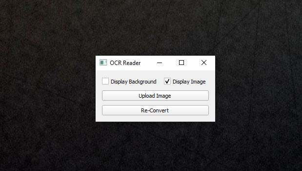
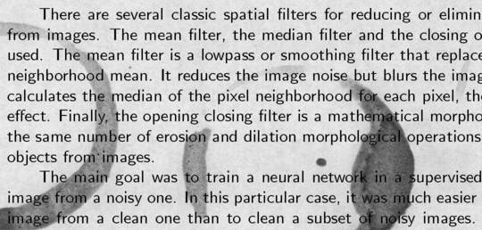
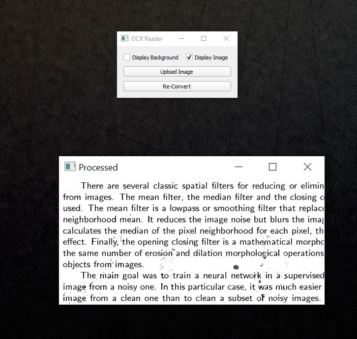

# GUI - Extract image text to .txt file
 <br>
<br>
##### The application can extract the text present in the images and save it to .txt file. <br> 
##### It is capable to extract images with noise around the text. The example of usage of application is outlined below. <br>
### Run application


### Select options available (Eg. to display masked background incase of noise around the text in the image; display processed image)


### Click upload image and above example image is imported then processed
 <br>

To use the project: <br>
First check with requirements
```python
pip install requirements.txt
```
then run GUI.py
```python
python3 GUI.py
```

Have fun with digitalization :)
